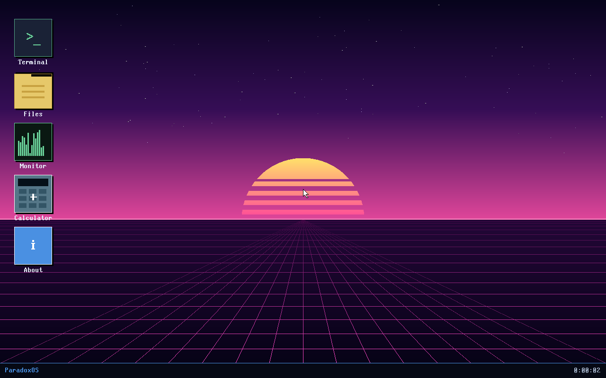

<!-- Improved compatibility of back to top link: See: https://github.com/othneildrew/Best-README-Template/pull/73 -->
<a id="readme-top"></a>

<!-- PROJECT SHIELDS -->
[![Contributors][contributors-shield]][contributors-url]
[![Forks][forks-shield]][forks-url]
[![Stargazers][stars-shield]][stars-url]
[![Issues][issues-shield]][issues-url]


<!-- PROJECT LOGO -->
<br />
<div align="center">
  <a href="https://github.com/Sahilreddy/paradox-os">
    
  </a>

  <h3 align="center">ParadoxOS</h3>

  <p align="center">
    A hobby x86_64 operating system written from scratch — Multiboot2 stub to graphical desktop to real ring-3 ELF user programs, in C++ and assembly.
    <br />
    <br />
    <a href="https://github.com/Sahilreddy/paradox-os/issues/new?labels=bug&template=bug-report---.md">Report Bug</a>
    &middot;
    <a href="https://github.com/Sahilreddy/paradox-os/issues/new?labels=enhancement&template=feature-request---.md">Request Feature</a>
  </p>
</div>


<!-- TABLE OF CONTENTS -->
<details>
  <summary>Table of Contents</summary>
  <ol>
    <li>
      <a href="#about-the-project">About The Project</a>
      <ul>
        <li><a href="#built-with">Built With</a></li>
      </ul>
    </li>
    <li>
      <a href="#getting-started">Getting Started</a>
      <ul>
        <li><a href="#prerequisites">Prerequisites</a></li>
        <li><a href="#installation">Installation</a></li>
      </ul>
    </li>
    <li><a href="#usage">Usage</a></li>
    <li><a href="#architecture">Architecture</a></li>
    <li><a href="#roadmap">Roadmap</a></li>
    <li><a href="#contributing">Contributing</a></li>
    <li><a href="#license">License</a></li>
    <li><a href="#contact">Contact</a></li>
    <li><a href="#acknowledgments">Acknowledgments</a></li>
  </ol>
</details>


<!-- ABOUT THE PROJECT -->
## About The Project

![ParadoxOS desktop][product-screenshot]

ParadoxOS is a hobby x86_64 OS I'm building from scratch in C++ and assembly. No libc, no Linux kernel, no graphics library. Multiboot2 stub up to a graphical desktop, real ring-3 user mode, an ELF64 loader, and a shell that can run scripts.

What works today:

* 1280x800 framebuffer desktop with a procedural synthwave wallpaper
* Draggable windows, taskbar, live clock, PS/2 mouse + keyboard
* Five apps: Terminal, Files (with editor), System Monitor, Calculator, About
* VFS that persists `/home` to disk via the ATA PIO driver — edits survive reboot
* Ring-3 user mode with TSS, `iretq`, and `int 0x80` syscalls
* ELF64 loader that runs separately-compiled C programs with SysV `argc`/`argv`
* Shell with built-ins + `/bin/<name>` fallback + script runner (`sh /home/demo.sh`)

Runs in QEMU on Linux. Should boot on real hardware too (Multiboot2 BIOS, framebuffer GPU, PS/2 mouse).

<p align="right">(<a href="#readme-top">back to top</a>)</p>


### Built With

* [![CPP][CPP-shield]][CPP-url]
* [![C][C-shield]][C-url]
* [![NASM][NASM-shield]][NASM-url]
* [![GRUB][GRUB-shield]][GRUB-url]
* [![QEMU][QEMU-shield]][QEMU-url]
* [![Linux][Linux-shield]][Linux-url]

<p align="right">(<a href="#readme-top">back to top</a>)</p>


<!-- GETTING STARTED -->
## Getting Started

These steps clone the repo, install the toolchain, and boot ParadoxOS in QEMU.

### Prerequisites

Development tools (Debian/Ubuntu). One command:

```sh
make install-tools
```

That installs `nasm`, `qemu-system-x86`, `grub-pc-bin`, `xorriso`, `mtools`, and `build-essential`. On other distros, install the equivalent packages.

### Installation

1. Clone the repo
   ```sh
   git clone https://github.com/Sahilreddy/paradox-os.git
   cd paradox-os
   ```
2. Build the kernel + ISO + disk image
   ```sh
   make
   ```
3. Boot in QEMU
   ```sh
   make run
   ```
4. Optional: boot under GDB at vector 0 (port 1234)
   ```sh
   make debug
   ```

QEMU controls: `Ctrl+Alt+G` releases the mouse from the VM, `Ctrl+C` in the launching shell quits.

<p align="right">(<a href="#readme-top">back to top</a>)</p>


<!-- USAGE EXAMPLES -->
## Usage

ParadoxOS lands you on a desktop with five clickable icons. Some things to try:

**Run a shell script**
1. Click the Terminal icon
2. Type `sh /home/demo.sh` and press Enter
3. Watch the shell run `pwd`, `ls /bin`, `uptime`, `memory`, and launch a real ring-3 ELF with `argv`

![Shell script demo][script-screenshot]

**Run a ring-3 ELF program with arguments**
1. Click the Files icon
2. Click into the `args:` field at the top of the window and type a few words
3. Double-click `bin` to enter `/bin`, select `elf-hello`, click **Run**
4. The Terminal pops with the program's output — the words you typed arrive as `argv` inside a CPL=3 ELF binary

![Files in /bin][bin-screenshot]

**Edit and persist a file**
1. Files → `/home` → click `welcome.txt` → **Edit**
2. Type some text
3. Click **Save** — the file is flushed through the ATA PIO driver to a custom on-disk format; survives reboot

**Shell built-ins:** `help`, `ls`, `cd`, `pwd`, `cat`, `echo`, `sh`, `ps`, `uptime`, `memory`, `lspci`, `reboot`, `clear`, `info`, `syscall`, `spawn`

**Ring-3 programs in /bin:** `hello` (hand-coded raw bytes), `elf-hello` (real ELF that prints its `argv`), `echo`, `cat` (reads a line via SYS_READ), `clear`, `uptime`, `meminfo`

<p align="right">(<a href="#readme-top">back to top</a>)</p>


<!-- ARCHITECTURE -->
## Architecture

```
src/
├── boot/                       # multiboot2 header, boot.asm, asm IRQ stubs,
│                               # ring-3 jump/return, syscall handler stub
├── kernel/                     # all C++ kernel code
│   ├── kernel.cpp              #   entry, init order, main loop
│   ├── gdt.cpp / tss.cpp       #   segment descriptors + TSS for ring 3
│   ├── idt.cpp                 #   interrupt descriptor table
│   ├── paging.cpp / pmm.cpp    #   4-level paging, physical page allocator
│   ├── heap.cpp                #   kernel heap
│   ├── framebuffer.cpp         #   linear framebuffer
│   ├── font.cpp                #   8x16 bitmap font
│   ├── gui.cpp                 #   compositor, desktop, apps, taskbar, wallpaper
│   ├── mouse.cpp               #   PS/2 mouse
│   ├── keyboard.cpp            #   PS/2 keyboard, routes to shell/editor/stdin
│   ├── elf.cpp                 #   ELF64 loader
│   ├── usermode.cpp            #   ring-3 entry with argv user stack frame
│   ├── syscall.cpp             #   SYS_READ, SYS_WRITE, SYS_EXIT, SYS_HELLO ...
│   ├── stdin.cpp               #   line-buffered stdin for ring-3 SYS_READ
│   ├── vfs.cpp                 #   in-memory file tree
│   ├── diskfs.cpp              #   ATA-backed persistence for /home
│   ├── ata.cpp                 #   ATA PIO read/write
│   ├── pci.cpp                 #   PCI bus enumeration
│   └── shell.cpp               #   interactive shell + script runner
└── include/                    # headers

user/
├── crt0.asm                    # C runtime stub: reads argc/argv off rsp, calls main()
├── syscall.h                   # shared int 0x80 stubs
├── hello.c, echo.c, cat.c      # ring-3 programs (each builds to its own ELF)
└── user.ld                     # links at 0x08000000

build/                          # objects, ELFs, ISO, disk image, screenshots
```

Gotchas worth knowing about:

* Every page-table level needs the U bit, not just the leaf — otherwise ring 3 faults with `PRESENT READ USER`
* `usermode_return` restores RFLAGS via `popfq`, because `int 0x80` is an interrupt gate (clears IF) and the longjmp-style return path skips iretq
* The ELF segment-copy loop uses a `volatile` destination — without it, `-O2` deletes the whole loop
* User binaries link at 0x08000000 (128 MiB), well below the 512 MiB QEMU RAM cap

<p align="right">(<a href="#readme-top">back to top</a>)</p>


<!-- ROADMAP -->
## Roadmap

### Track A — graphical foundation (done)
- [x] Multiboot2 framebuffer at 1280x800x32
- [x] 8x16 bitmap font, PS/2 mouse cursor overlay
- [x] Desktop with boot splash + five clickable icons
- [x] Draggable windows, taskbar with per-window buttons + live clock
- [x] Procedural synthwave wallpaper

### Track B — userspace (done)
- [x] Custom GDT with S bit + TSS loaded
- [x] Ring 3 via `iretq`, `int 0x80` syscalls
- [x] ELF64 loader for separately-compiled C programs
- [x] System V `argc`/`argv` built on the user stack
- [x] SYS_READ via line-buffered stdin
- [x] Interactive shell + script runner (`sh <path>`)

### Track C — persistence & networking (in progress)
- [x] ATA PIO read + write
- [x] In-memory VFS + on-disk persistence for `/home`
- [x] Files app with text editor + Save
- [x] e1000 NIC enumerated via PCI (BAR0 visible, not driven yet)
- [ ] FAT32 filesystem
- [ ] e1000 RX/TX
- [ ] ARP + ICMP ping
- [ ] TCP/IP stack

### Beyond Track C
- [ ] Per-process page tables (today, the global U bit leaks kernel memory to ring 3)
- [ ] Preemptive scheduling between ring-3 processes
- [ ] `fork()` / `exec()`
- [ ] Real signal handling
- [ ] AHCI/SATA driver

See [open issues](https://github.com/Sahilreddy/paradox-os/issues) for the live list.

<p align="right">(<a href="#readme-top">back to top</a>)</p>


<!-- CONTRIBUTING -->
## Contributing

PRs and issues welcome.

1. Fork the project
2. Create a feature branch (`git checkout -b feature/cool-thing`)
3. Commit your changes (`git commit -m 'Add cool thing'`)
4. Push (`git push origin feature/cool-thing`)
5. Open a pull request

### Top contributors

<a href="https://github.com/Sahilreddy/paradox-os/graphs/contributors">
  
</a>

<p align="right">(<a href="#readme-top">back to top</a>)</p>


<!-- LICENSE -->
## License

Distributed under the MIT License. See `LICENSE` for details.

<p align="right">(<a href="#readme-top">back to top</a>)</p>


<!-- CONTACT -->
## Contact

Sahil Reddy — sahilreddy5@gmail.com

Project Link: [https://github.com/Sahilreddy/paradox-os](https://github.com/Sahilreddy/paradox-os)

<p align="right">(<a href="#readme-top">back to top</a>)</p>


<!-- ACKNOWLEDGMENTS -->
## Acknowledgments

* [OSDev Wiki](https://wiki.osdev.org)
* [Multiboot2 Specification](https://www.gnu.org/software/grub/manual/multiboot2/multiboot.html)
* [Intel SDM Vol. 3](https://www.intel.com/content/www/us/en/developer/articles/technical/intel-sdm.html)
* [AMD64 Architecture Programmer's Manual](https://www.amd.com/system/files/TechDocs/40332.pdf)
* [System V x86_64 ABI](https://gitlab.com/x86-psABIs/x86-64-ABI)
* [ELF-64 Object File Format](https://uclibc.org/docs/elf-64-gen.pdf)
* [othneildrew/Best-README-Template](https://github.com/othneildrew/Best-README-Template)

<p align="right">(<a href="#readme-top">back to top</a>)</p>


<!-- MARKDOWN LINKS & IMAGES -->
[contributors-shield]: https://img.shields.io/github/contributors/Sahilreddy/paradox-os.svg?style=for-the-badge
[contributors-url]: https://github.com/Sahilreddy/paradox-os/graphs/contributors
[forks-shield]: https://img.shields.io/github/forks/Sahilreddy/paradox-os.svg?style=for-the-badge
[forks-url]: https://github.com/Sahilreddy/paradox-os/network/members
[stars-shield]: https://img.shields.io/github/stars/Sahilreddy/paradox-os.svg?style=for-the-badge
[stars-url]: https://github.com/Sahilreddy/paradox-os/stargazers
[issues-shield]: https://img.shields.io/github/issues/Sahilreddy/paradox-os.svg?style=for-the-badge
[issues-url]: https://github.com/Sahilreddy/paradox-os/issues
[license-shield]: https://img.shields.io/github/license/Sahilreddy/paradox-os.svg?style=for-the-badge
[license-url]: https://github.com/Sahilreddy/paradox-os/blob/main/LICENSE
[linkedin-shield]: https://img.shields.io/badge/-LinkedIn-black.svg?style=for-the-badge&logo=linkedin&colorB=555
[linkedin-url]: https://linkedin.com/in/YOUR_LINKEDIN

[product-screenshot]: docs/wallpaper.png
[script-screenshot]: docs/script2.png
[bin-screenshot]: docs/bin_view.png

[CPP-shield]: https://img.shields.io/badge/C++-00599C?style=for-the-badge&logo=cplusplus&logoColor=white
[CPP-url]: https://isocpp.org/
[C-shield]: https://img.shields.io/badge/C-A8B9CC?style=for-the-badge&logo=c&logoColor=black
[C-url]: https://en.wikipedia.org/wiki/C_(programming_language)
[NASM-shield]: https://img.shields.io/badge/NASM-000000?style=for-the-badge&logo=assemblyscript&logoColor=white
[NASM-url]: https://www.nasm.us/
[GRUB-shield]: https://img.shields.io/badge/GRUB2-4E5B5E?style=for-the-badge&logo=gnu&logoColor=white
[GRUB-url]: https://www.gnu.org/software/grub/
[QEMU-shield]: https://img.shields.io/badge/QEMU-FF6600?style=for-the-badge&logo=qemu&logoColor=white
[QEMU-url]: https://www.qemu.org/
[Linux-shield]: https://img.shields.io/badge/Linux-FCC624?style=for-the-badge&logo=linux&logoColor=black
[Linux-url]: https://www.kernel.org/
